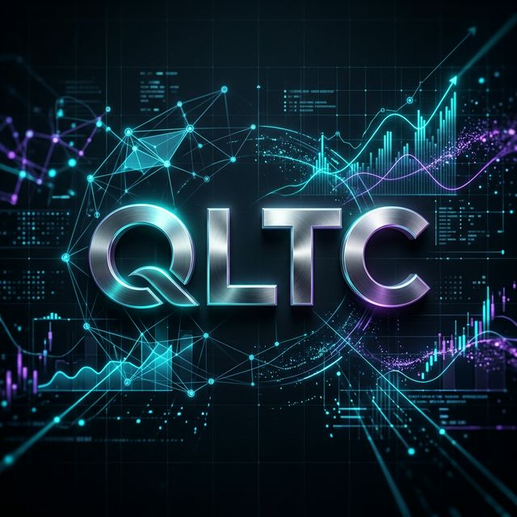

# QLTC - The Cinematic Financial Architect

<div align="center">

[](https://reactjs.org)
[](https://vitejs.dev)
[](https://supabase.com)
[](LICENSE)

**A premium personal finance management system with a "Cinematic" experience.**  
*Smart management of the 6 financial jars, absolute security with Supabase, and a modern Glassmorphism UI.*

</div>

---

## 📽️ The Cinematic Tech Experience

QLTC isn't just a money management app; it's a **technological masterpiece** designed to redefine how you interact with your financial data.

- **🌌 Glassmorphism Dashboard**: A translucent glass interface, blending perfectly with smooth, fluid transitions.
- **⚡ Real-time Sync**: Instant synchronization across all devices via the Supabase Cloud ecosystem.
- **🛡️ Privacy First**: Database-level security with Row Level Security (RLS), ensuring your data remains yours alone.
- **📊 Smart Jars**: An automated mechanism to allocate income into the 6 financial jars (NEC, FFA, LTS, EDU, PLAY, GIVE).

---

## ✨ Key Features

- **🚀 Login Wall**: Secure your data from the start with Email/Password and Google OAuth authentication.
- **🌊 Premium Loading**: A seamless startup experience with a cinematic pulse effect and a stylish progress bar.
- **📊 Visual Analytics**: Track your cash flow through sharp, interactive charts.
- **💸 Debt Deduction**: An intelligent mechanism to deduct debts before allocating funds into jars.

---

## 🛠️ Core Tech Stack

```json
{
  "Front-end": ["React 18", "Vite", "Vanilla CSS"],
  "Backend": ["Supabase Authentication", "PostgreSQL"],
  "Icons": ["Lucide React"],
  "Deployment": ["Vercel / Netlify Optimized"]
}
```



<div align="center">

*Built with 💙 by frenkie.*  
**QLTC - Control the Flow, Master the Future.**

</div>
