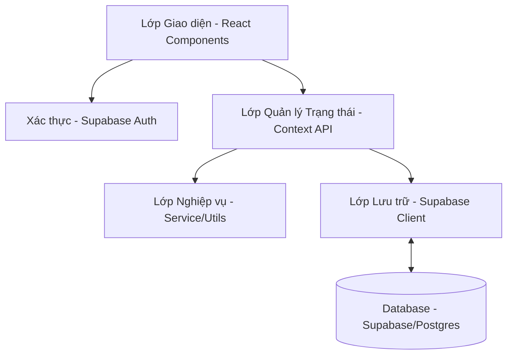

# Kiến trúc Tổng thể (Architecture Overview) - QLTC

Tài liệu này định hình cách ứng dụng được xây dựng về mặt kỹ thuật, đảm bảo tính mở rộng và dễ bảo trì.

## 1. Mô hình Phân lớp (Layered Architecture)

Ứng dụng được chia làm 4 lớp chính:

- **UI Layer**: Chịu trách nhiệm hiển thị và nhận tương tác.
- **Auth Layer**: Xử lý Đăng nhập/Đăng xuất (Email & Google OAuth).
- **State Layer (Context API)**: Quản lý trạng thái cục bộ, đồng bộ hóa giữa UI và Supabase.
- **Storage Layer**: Gọi các API của Supabase để đọc/ghi dữ liệu.

## 2. Luồng Dữ liệu (Data Flow)

### Thêm một giao dịch chi tiêu:
1. **User** nhấn "Lưu" trên Form.
2. **UI** gọi hàm `addTransaction` từ Context.
3. **Context** gọi **Logic** để kiểm tra tính hợp lệ (Số dư hũ).
4. Nếu hợp lệ, **Context** cập nhật State cục bộ và gọi **Storage** để lưu vào LocalStorage.
5. **UI** tự động render lại nhờ State thay đổi.

## 3. Quản lý Trạng thái (State Management)

Chúng ta sẽ sử dụng 2 Context chính:
- **`FinanceContext`**: Quản lý toàn bộ giao dịch (`transactions`) và cấu hình các hũ (`jars`).
- **`ThemeContext`**: Quản lý chủ đề Dark/Light (mặc dù mặc định là Dark Premium).

## 4. Công nghệ Lựa chọn
- **Framework**: React 18+ với Vite (Tốc độ phát triển cực nhanh).
- **Styling**: Vanilla CSS (CSS Variables) để kiểm soát 100% cảm giác "Premium" và hiệu ứng Glassmorphism.
- **Icons**: Lucide React.
- **Charts**: Recharts hoặc Chart.js (Dành cho báo cáo).

## 5. Chiến lược Bảo mật & Riêng tư
- Toàn bộ dữ liệu **nằm tại máy người dùng**. Hệ thống không có Server, không gửi dữ liệu ra ngoài.
- Dự phòng: Cho phép Export/Import file JSON để người dùng tự lưu trữ hoặc chuyển sang thiết bị khác.
