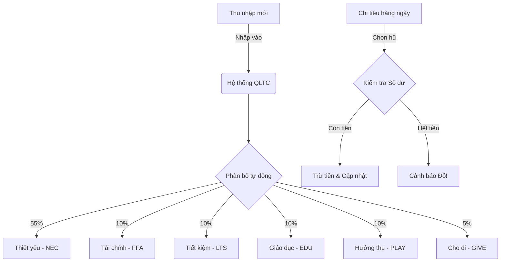

# Sơ đồ Cấu trúc Tài liệu & Quy trình Hệ thống QLTC

Dưới đây là sơ đồ hình dung cách hệ thống của bạn sẽ vận hành và cách các tài liệu liên quan được tổ chức.

## 1. Luồng Hoạt động (Quy trình 6 Hũ)

## 2. Cấu trúc Tài liệu Dự án (Đã phân loại)

Tài liệu được tổ chức theo từng vai trò để bạn dễ dàng tra cứu:

### 📂 [1.Requirement](./1.Requirement) (Tài liệu Yêu cầu)
- **[PRD.md](./1.Requirement/PRD.md)**: Xác định "Sản phẩm làm cái gì?". Mục tiêu, tính năng chính và KPI.
- **[USER_FLOW.md](./1.Requirement/USER_FLOW.md)**: Mô tả luồng đi của người dùng trong app.

### 📂 [2.Business](./2.Business) (Phân tích Nghiệp vụ - BA)
- **[BUSINESS_LOGIC.md](./2.Business/BUSINESS_LOGIC.md)**: Xác định "Quy tắc nghiệp vụ là gì?". Logic 6 hũ, quy tắc phân bổ, điều chuyển tiền.

### 📂 [3.Technical](./3.Technical) (Tài liệu Kỹ thuật)
- **[ARCHITECTURE.md](./3.Technical/ARCHITECTURE.md)**: Kiến trúc tổng thể, luồng dữ liệu, quản lý trạng thái.
- **[DATABASE.md](./3.Technical/DATABASE.md)**: Sơ đồ dữ liệu (JSON/LocalStorage/IndexedDB).
- **[FOLDER_STRUCTURE.md](./3.Technical/FOLDER_STRUCTURE.md)**: Cách tổ chức mã nguồn (Source code).

### 📂 [4.Design](./4.Design) (Thiết kế UI/UX)
- **[DESIGN_SYSTEM.md](./4.Design/DESIGN_SYSTEM.md)**: Màu sắc, phông chữ, phong cách Glassmorphism.
